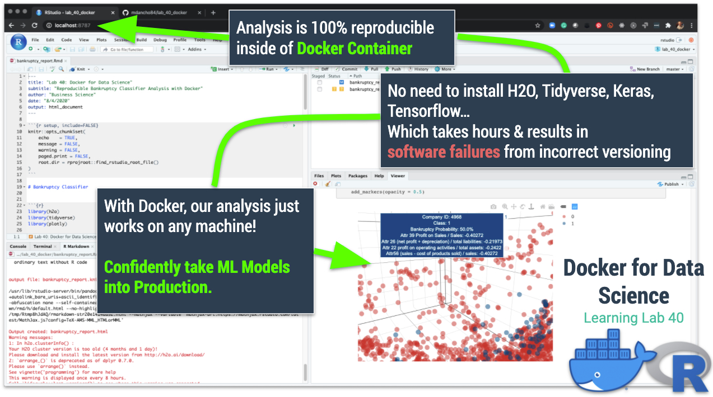

# Docker for Data Science (Lab 40)

This lab illustrates the importance of using Docker for __Reproducible Analysis & Production Environments.__

This github repo contains:

- RMarkdown Report for H2O Bankruptcy
- Dockerfile used to create the "h2o-verse" H2O + Tidyverse Environment

The [h2o-verse](https://hub.docker.com/repository/docker/mdancho/h2o-verse) docker container can be downloaded from DockerHub. 

The [lab_40_docker](https://github.com/mdancho84/lab_40_docker) code repository can be downloaded / cloned from GitHub. 

Note that this repository __does not__ include the code to generate H2O Grid Search Models & use MLFlow for Tracking the grid search models. [Upgrade to Learning Labs PRO.](https://university.business-science.io/p/learning-labs-pro)

